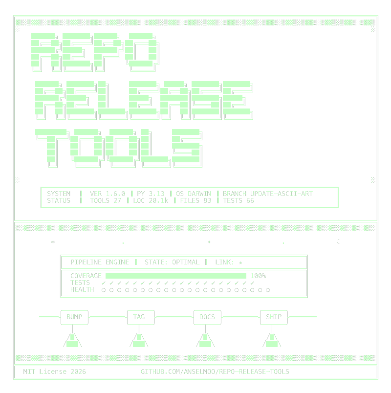

# repo-release-tools

<picture>
  <source media="(prefers-color-scheme: dark)" srcset="docs/assets/banner.png">
  
</picture>

`repo-release-tools` keeps release policy boring in the best possible way.

Use it from **GitHub Marketplace** when you want CI to validate branch names,
commit subjects, and changelog policy. Install it from **PyPI** when you want a
local CLI, hook integration, version bumps, and release-branch automation.

- GitHub Marketplace action: <https://github.com/marketplace/actions/repo-release-tools-policy-checks>
- PyPI package: <https://pypi.org/project/repo-release-tools/>

<!-- rrt:auto:start:readme-toc -->
- [Choose your entry point](#choose-your-entry-point)
  - [Use the GitHub Action for CI policy checks](#use-the-github-action-for-ci-policy-checks)
  - [Use the Python package for local workflow automation](#use-the-python-package-for-local-workflow-automation)
- [Changelog workflows](#changelog-workflows)
- [What the project includes](#what-the-project-includes)
- [Start with the doc that matches your task](#start-with-the-doc-that-matches-your-task)
- [License](#license)
<!-- rrt:auto:end:readme-toc -->

## Choose your entry point

### Use the GitHub Action for CI policy checks

Choose the action if you want pull requests and pushes to fail fast when a repo
drifts from your release policy.

- validates branch names such as `feat/add-parser`
- validates Conventional Commit subjects
- validates changelog policy in CI
- optionally checks that the working tree stays clean
- can run `rrt doctor` as a pre-release health gate

```yaml
- uses: actions/checkout@v6
  with:
    fetch-depth: 0

- uses: Anselmoo/repo-release-tools@v1.6.0
  with:
    check-branch-name: "true"
    check-commit-subject: "true"
    check-changelog: "true"
```

See the full action guide:
<https://github.com/Anselmoo/repo-release-tools/blob/main/docs/action.md>

See the full CLI and commands reference:
<https://github.com/Anselmoo/repo-release-tools/blob/main/docs/commands/rrt-cli.md>

### Use the Python package for local workflow automation

Choose the package if you want the developer-side tools: branch helpers,
version bumps, config inspection, pre-commit hooks, and release automation.

```bash
pip install repo-release-tools
rrt init
rrt branch new feat "add parser"
rrt git commit "add parser"
rrt git doctor
rrt bump patch
```

Or run the CLI without installing it permanently:

```bash
uvx repo-release-tools branch new feat "add parser"
```

If `rrt` is already installed and you want the bundled agent skill for Copilot,
Claude, or Codex, install it with:

```bash
rrt skill install --target copilot-local
rrt skill install --target claude-local --target codex-local
rrt skill install --target codex-global --dry-run
```

For basic versioning, `bump` and `ci-version` can run without `[tool.rrt]` by
auto-detecting root-level `pyproject.toml`, `package.json`, and `Cargo.toml`.
If multiple version files are found, they are updated together. Explicit config
is for the nice extras: grouped releases, changelog paths, release branches,
lock commands, generated files, and custom patterns.

## Changelog workflows

Pick the style that matches how your repository lands changes.

**`incremental` (default)** — for teams that maintain changelog entries during development.
- `rrt-update-unreleased` and `rrt-changelog` hooks stay active.
- The GitHub Action resolves `changelog-strategy: auto` to `per-commit`.
- `rrt bump` defaults to `auto`.

**`squash`** — for repositories that squash many commits into one PR merge.
- Changelog write and check hooks skip enforcement.
- The GitHub Action resolves `changelog-strategy: auto` to `release-only`.
- `rrt bump` defaults to `generate`.

Minimal config:

```toml
[tool.rrt]
release_branch = "release/v{version}"
changelog_file = "CHANGELOG.md"
changelog_workflow = "incremental"  # or "squash"

[[tool.rrt.version_targets]]
path = "pyproject.toml"
kind = "pep621"
```

Native config is also supported in `package.json` (`"rrt": { ... }`) and
`Cargo.toml` (`[package.metadata.rrt]` / `[workspace.metadata.rrt]`). Go repos
should use `.rrt.toml` or `.config/rrt.toml`.

## What the project includes

- `rrt` CLI for branches, bumps, config inspection, and Git helpers
- `rrt-hooks` for `pre-commit`, `lefthook`, and CI validation
- a reusable GitHub Action in `action.yml`
- bundled agent skills for `uvx` and installed-CLI workflows
- docs for branch policy, hook setup, and release workflows

## Start with the doc that matches your task

<!-- rrt:auto:start:readme-links -->
- Docs index: <https://github.com/Anselmoo/repo-release-tools/blob/main/docs/index.md>
- GitHub Action: <https://github.com/Anselmoo/repo-release-tools/blob/main/docs/action.md>
- CLI reference: <https://github.com/Anselmoo/repo-release-tools/blob/main/docs/commands/rrt-cli.md>
- Hook setup: <https://github.com/Anselmoo/repo-release-tools/blob/main/docs/commands/hooks.md>
- Conventional branches: <https://github.com/Anselmoo/repo-release-tools/blob/main/docs/commands/branch.md>
- Git workflow helpers: <https://github.com/Anselmoo/repo-release-tools/blob/main/docs/commands/git_cmd.md>
- Agent skills: <https://github.com/Anselmoo/repo-release-tools/blob/main/docs/commands/skill.md>
- Project tree: <https://github.com/Anselmoo/repo-release-tools/blob/main/docs/commands/tree.md>
- Markdown TOC: <https://github.com/Anselmoo/repo-release-tools/blob/main/docs/commands/toc.md>
- Config health checks: <https://github.com/Anselmoo/repo-release-tools/blob/main/docs/commands/doctor.md>
- Runtime EOL tracking: <https://github.com/Anselmoo/repo-release-tools/blob/main/docs/commands/eol_check.md>
- Agent instructions: <https://github.com/Anselmoo/repo-release-tools/blob/main/docs/agent-instructions.md>
<!-- rrt:auto:end:readme-links -->

## License

`repo-release-tools` is released under the MIT License.

Some workflow ideas were initially inspired by
[`joseluisq/gitnow`](https://github.com/joseluisq/gitnow), but the `rrt git`
surface is intentionally narrower and reshaped around conventional branching,
safe commits, and release automation.
