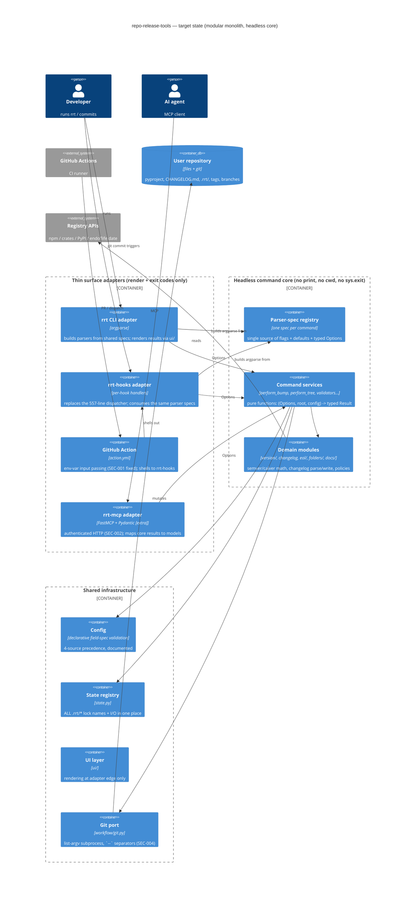
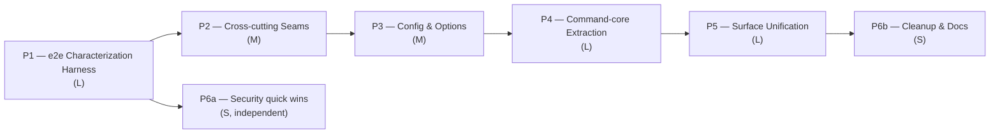

# Modernization Brief — repo-release-tools

*Generated 2026-07-10 by `/modernize-brief`. No prior brief existed (fresh generation, no staleness conflict).*

**Inputs synthesized:**

| Input | Modified | Produced by |
|---|---|---|
| `analysis/the/ASSESSMENT.md` | 2026-07-10 07:49 | `/modernize-assess` |
| `analysis/the/topology.json` (+3 `.mmd`, `TOPOLOGY.html`) | 2026-07-10 07:52 | `/modernize-map` |
| `analysis/the/BUSINESS_RULES.md` (338 rules) | 2026-07-10 16:44 | `/modernize-extract-rules` |

**Target stack:** current stack, uplifted in place — typed Python ≥3.12, stdlib-only runtime core (policy), uv/tox toolchain unchanged. No re-platforming.

---

## 1. Objective

Move `repo-release-tools` from a **function-based codebase where three product surfaces (CLI, git hooks, GitHub Action/MCP) independently reimplement command behavior** — 50 functions over CCN 15, a 557-line hook dispatcher that hand-copies CLI defaults, an MCP bump that silently diverges from the real one, and printing/`Path.cwd()` welded into core logic — to a **modular monolith with a headless command core**: each command a pure, typed function (`perform_bump(...) -> BumpResult`) that every surface calls, rendering and process-exit pushed to thin adapters at the edges. Why now: the behavior is correct and stable (v1.11.2, #140 fixed), which makes this the cheapest moment to pin it with the currently missing end-to-end test layer and refactor beneath — and the phased structure is deliberately sized so Sonnet/Haiku-class agents can execute each phase against a machine-checkable contract (338 extracted rules, 85.71% coverage floor, `rrt docs map --check` drift gates).

**On "is centralization the latest trend":** what's current is *not* centralizing logic into one core object — it's the **modular monolith with vertical slices**: keep each command's logic in its own slice (as `commands/` already does), but centralize the *cross-cutting concerns* — error handling, config loading, output rendering, filesystem roots — into shared, injected seams, and make surfaces thin adapters over a headless core (hexagonal / ports-and-adapters). Equally current: replacing `try/except`-as-control-flow with typed results and explicit error taxonomies. The plan below centralizes exactly five things (parser specs, config validation, error boilerplate, `.rrt/` naming, rendering) and deliberately leaves command logic decentralized in slices. rrt's structure is actually close to this trend already — the gap is the missing seams, not the layout.

## 2. Target Architecture



### Legacy → target mapping

| Legacy component | Target component(s) | Change |
|---|---|---|
| `cli.py` + 27 `register()` fns | CLI adapter + **parser-spec registry** | `register()` exports a spec object; argparse built from it |
| `workflow/hooks.py:main` (557 lines, CCN 40) | **Per-hook handlers** consuming parser specs | Namespace-synthesis deleted; #140 bug class eliminated structurally |
| `commands/bump.py:cmd_bump` (CCN 62) | `perform_bump() -> BumpResult` + thin renderer | Phase functions: resolve → apply → assets → git-finalize |
| `commands/tree.py:cmd_tree` (CCN 54) | `manifest.py` (read/write/diff, one atomic-write helper) + mode dispatch | Two duplicated tempfile blocks collapse to one |
| `mcp/tools/version_tools.py` partial bump | MCP adapter calling `perform_bump` | Divergence (debt #2) fixed by construction |
| `version/targets.py` print-in-core | Mutators return changed-path events; rollback reports failures | `redirect_stdout` hack in MCP deleted; `except OSError: pass` fixed |
| `config/core.py` isinstance ladders (1,391 lines) | Declarative field-spec table + generic walker | ~400 lines collapse; new keys one-liners; still zero-dep |
| 209 `getattr(args,...)` + 54× `verbose` idiom | Frozen `Options.from_args()` per command | One default per flag, typed contract |
| ~12× copy-pasted config-load try/except | `load_config_or_exit()` in `commands/_common.py` | One seam |
| 71 `Path.cwd()` sites | `root: Path` threaded from entrypoints | e2e tests gain temp-repo injection |
| `.rrt/` names in 10+ files | `state.py` registry constants | Single `.rrt/` owner |
| `hooks.py`, `docs/markdown.py` shims; `docs/formats/html.py` | Deleted (or html wired into `_RENDERERS`) | SME decision, §7 |
| `action.yml` inline `${{ inputs.* }}` (SEC-001) | `env:`-passed inputs | Same file, safe pattern it already uses elsewhere |
| MCP HTTP transport unauthenticated (SEC-002) | Token auth + localhost default + server-side force-push gate | Confirmation parity with CLI (defect D4/D6) |

## 3. Phased Sequence

Same-stack uplift → **build-graph leaf-first** ordering. Every phase executes via **`/modernize-uplift`** (no cross-stack transform, no rebuild). Phases are scoped so a Sonnet 5 agent (Haiku for the mechanical sweeps in P2/P6) can hold the whole phase in context; every phase exits through the same three gates: **e2e suite green · coverage ≥ 85.71% · `uvx pre-commit run --all-files` clean**.

COCOMO shares below apportion the assessment's index of ≈95 by the SLOC each phase touches; T-shirt sizes rank phases against each other — **not durations; no time or cost is stated in this plan.**



### Phase 1 — e2e Characterization Harness *(the user's stated biggest gap — first, deliberately)*
- **Scope:** new `tests/e2e/` exercising all three surfaces as users do: run `rrt`/`rrt-hooks` as subprocesses in temp git repos; simulate the Action's steps; MCP tools in-process. Pin every §5 contract item + the 9 suspected defects (as-is until SME rules). Golden-file tests for `--dry-run` output (the rrt-ux-contract glyph structure is itself a behavior). No `src/` changes except test hooks agreed trivial.
- **Entry:** §5 P0 list SME-confirmed; defect fix-or-pin ruled (§7).
- **Exit:** every P0 item has ≥1 e2e test; all 3 surfaces covered; suite green on tox 3.12/3.13/3.14; wired into CI as a required gate; hook-latency benchmark recorded as baseline.
- **Scale:** L (~25% of index — test code proportional to the contract, not the refactor).
- **Risk: Medium.** (1) Characterizing a defect as intended → SME gate in §7 first. (2) Golden-file tests brittle to cosmetic output changes → assert on structure (glyph vocabulary), not full byte-equality, where the ux-contract allows.

### Phase 2 — Cross-cutting Seams (leaf modules)
- **Scope:** `version/targets.py` (return events, fix `except OSError: pass` rollback), thread `root: Path` from entrypoints (kill 71 `Path.cwd()`), centralize `.rrt/*` names in `state.py`, replace the 30 broad `except Exception` sites with type checks / narrow excepts, delete decorative progress loops in `bump.py:379-409`.
- **Entry:** P1 suite green (safety net exists).
- **Exit:** zero `Path.cwd()` outside entrypoints; zero prints under `version/`; `state.py` is sole `.rrt/` name owner; MCP's `redirect_stdout` hack deleted; e2e + unit green.
- **Scale:** M (~15%). Mechanical sweeps here are **Haiku-suitable**.
- **Risk: Low.** (1) Hidden cwd-dependence in tests → run full tox matrix per module. (2) Output-shape drift breaking string-matching unit tests → adjust tests with the ux-contract as arbiter.

### Phase 3 — Config & Options
- **Scope:** declarative field-spec walker replacing `config/core.py` isinstance ladders (`_load_version_group` CCN 42 → table); `load_config_or_exit()` helper replacing ~12 copy-pasted blocks; per-command frozen `Options.from_args()` replacing 209 `getattr` reads.
- **Entry:** P2 merged (root-threading done — Options carry it).
- **Exit:** `config/core.py` shrinks ≥25%; zero `getattr(args, ...)` in `commands/`; every config-validation error message preserved verbatim (e2e-pinned); coverage floor holds.
- **Scale:** M (~15%).
- **Risk: Medium.** (1) Error-message drift breaking users' scripts/CI greps → pin messages in P1 goldens. (2) Four-source precedence subtly reordered → precedence rules from BUSINESS_RULES.md get dedicated e2e cases before touching the loader.

### Phase 4 — Command-core Extraction
- **Scope:** `perform_bump() -> BumpResult` (from `cmd_bump` CCN 62, phase functions resolve/apply/assets/git-finalize); `manifest.py` extraction from `cmd_tree` (CCN 54); same pattern for the next-worst commands (`git_inspect.cmd_doctor`, `doctor.cmd_doctor`, `release_cmd`). Rendering stays in thin `cmd_*` wrappers.
- **Entry:** P3 merged (Options are the core's input type).
- **Exit:** no function in `commands/` over CCN 25; `perform_*` functions have direct unit tests; e2e byte-identical on CLI output (dry-run and real, in temp repos).
- **Scale:** L (~25%).
- **Risk: Medium.** (1) Behavior drift in the bump pipeline's 6 stages → stage-by-stage extraction, e2e after each. (2) `git_finalize` ordering (branch→commit→tag) is contract → explicit e2e for the release walkthrough (§4 flow 1).

### Phase 5 — Surface Unification
- **Scope:** split `workflow/hooks.py:main` into per-hook handlers consuming the parser-spec registry (deletes the copy-pasted publish-snapshot spec and all Namespace synthesis); MCP tools rewired to `perform_*` (fixes partial-bump divergence D9, adds atomic rollback D9, confirmation parity D4/D6); resolve Git↔Hooks bidirectional import.
- **Entry:** P4 merged (core exists to unify onto).
- **Exit:** `rrt-hooks` CLI-compatible (same flags, same exit codes — e2e-proven); pylint R0801 clean across surfaces; MCP `rrt_bump` result ≡ CLI bump result on the same repo (contract test); hook latency ≤ P1 baseline +10%.
- **Scale:** L (~20%).
- **Risk: High** (touches every surface at once). (1) Hook flag/exit-code regressions breaking users' pre-commit configs → the Action's own `action.yml` steps run as e2e; version pins in `.pre-commit-hooks.yaml` tested. (2) MCP behavior change is *intended* (divergence fix) but must be release-noted as such → changelog entries mandatory, SME sign-off per §7-Q4.

### Phase 6 — Hardening & Cleanup
- **6a (independent, can start after P1):** SEC-001 (Action env-var inputs), SEC-003 (changelog path containment), SEC-004 (`--` separators), SEC-005 (URL quoting), SEC-006 (jq-built JSON), SEC-007 (MCP target allowlist). SEC-002 (MCP auth) lands with P5.
- **6b (after P5):** delete/wire `docs/formats/html.py`; remove `hooks.py` + `docs/markdown.py` shims (per §7-Q3); document `.rrt/` lock schema, config precedence, exit-code contract (the assessment's 5 doc gaps); sweep remaining CCN>15 tail.
- **Entry:** 6a: P1 green. 6b: P5 merged.
- **Exit:** security findings closed or risk-accepted in writing; dead-end list from topology.json empty; docs published.
- **Scale:** S (~10% combined). **Haiku-suitable** sweeps.
- **Risk: Low.** (1) Shim removal breaks unknown external importers → deprecation release first (§7-Q3). (2) Action input change alters workflow API → inputs keep names; only passing mechanism changes, e2e-verified.

## 4. Business Walkthroughs

The four persona flows from `topology.json` (open `TOPOLOGY.html` → walkthrough dropdown), mapped to the phases that touch them:

**Flow 1 — A maintainer releases a new version** *(persona: project maintainer)*

| What happens (business language) | Implemented today by | Phase that replaces it |
|---|---|---|
| Maintainer runs `rrt bump minor` | `cli.py` → `commands/bump.py:cmd_bump` | P4 (core extraction), P3 (Options) |
| Config is loaded and validated | `config/core.py` | P3 |
| Next version computed | `version/semver.py` / `calver.py` | unchanged (pinned P1) |
| Every version string rewritten together | `version/targets.py` | P2 (events + honest rollback) |
| Changelog section promoted | `changelog.py` | unchanged (pinned P1) |
| Release branch + commit created | `workflow/git.py` | P2 (seams), P6a (SEC-004) |

**Flow 2 — A contributor commits a change** *(persona: contributor)* — pre-commit hook validates branch/commit and auto-writes the changelog bullet. Today: `workflow/hooks.py` dispatcher + `changelog.py`. Replaced in **P5** (per-hook handlers); behavior pinned in **P1**; the squash-dedup subtlety (defect D2) needs the §7 ruling first.

**Flow 3 — CI gates a pull request** *(persona: reviewer / release manager)* — the Action re-runs the same checks in CI. Today: `action.yml` → `rrt-hooks`. Hardened in **P6a** (SEC-001/006 — including the `^\[Unreleased\]` grep that today never matches, defect D8), unified in **P5**.

**Flow 4 — An AI agent operates the repo via MCP** *(persona: AI coding agent)* — inspects versions, validates names, previews bumps. Today: `mcp/tools/*` with **silently different semantics** than the CLI (partial bump, weaker force-push confirmation). Fixed by construction in **P5** + SEC-002.

*(Flows were derived from entry points + code by `/modernize-map`; personas are inherent to a dev tool and need no further SME confirmation, but flow-step wording is open to correction.)*

## 5. Behavior Contract

The extraction workflow's independent P0 panel hit a usage limit, so P0 status below is **main-loop-adjudicated** under the criterion *"guards user-repository integrity or gates a destructive/irreversible operation"* and per the panel guidance that did land (pure version arithmetic is not P0). **Per the brief's own rule, P0 items without High-confidence independent confirmation are blockers: SME must confirm this list (§7-Q1) before Phase 1 starts.** The 58 raw candidates (with cross-round duplicates) are in BUSINESS_RULES.md; consolidated here into 12 canonical contract items:

| # | Contract item | Anchor citation(s) |
|---|---|---|
| C1 | Atomic multi-file version write: any failed target write rolls back all files already written; no-op substitution raises instead of silently passing | `version/targets.py:96-136` |
| C2 | Preflight gates every mutating bump: clean working tree required, checks ordered before any write | `preflight.py:17-68` |
| C3 | `publish-snapshot` (CLI) refuses without the explicit destructive-confirmation flag — absent flag silently downgrades to dry-run; refuses same-URL-as-origin remote; refuses during in-progress merge/rebase | `commands/git_sync.py:424-503`, `workflow/git.py:306-342` |
| C4 | `rebootstrap` requires explicit destructive confirmation and refuses repos with configured remotes unless `--allow-remote` | `commands/git_sync.py:235-266` |
| C5 | Tag/branch creation refuses to overwrite an existing name (tag force = delete-then-create, only with `--force`) | `commands/tag.py:132-176`, `commands/branch.py:191-197` |
| C6 | `[Unreleased]` promotion at bump: mode resolution (auto/promote/generate); workspace bump requires non-empty `[Unreleased]` | `commands/bump.py:152-269`, `commands/workspace.py:97-123` |
| C7 | Squash-merge changelog post-correction: exact-duplicate and opposite-verb bullet cancellation, restricted to the squash commit's own diff hunks | `workflow/hooks.py:281-455,458-509` |
| C8 | Branch-name policy: allowed fixed names, `release/v<semver>`, `<type>/<kebab-slug>` ≤60 chars; bot branches exempt from slug format | `workflow/hooks.py:50-105` |
| C9 | Commit-type → changelog-section mapping incl. `!` → Breaking Changes; Maintenance excluded unless opted in | `changelog.py:29-52,169-219` |
| C10 | Semver/calver bump math: component resets, pre-release channel start/advance/switch, same-day calver micro counter, leading-zero rejection | `version/semver.py:13-94`, `version/calver.py:52-98` |
| C11 | Stable-outranks-prerelease ordering; sync reports only strictly-newer versions | `version/semver.py:104-126` — *carries defect D1 (lexical label ordering); pin or fix per §7* |
| C12 | Auto-stash/checkout/restore lifecycle in `git move`/`sync` never loses uncommitted changes | `commands/git_sync.py:70-209` |

**Suspected defects requiring fix-or-pin ruling before their phase** (D-numbers referenced above; full text in BUSINESS_RULES.md): D1 semver lexical pre-release ordering (`rc.10` < `rc.2`) · D2 opposite-verb changelog cancellation is purely lexical · D3 `rrt init` `--force` inconsistency across manifest formats · D4/D6 MCP force-push confirmation weaker than CLI · D5 upstream fetchers collapse network failure into "no versions" · D7 calver `day < 10` scheme misclassification · D8 **Action changelog grep `^\[Unreleased\]` can never match `## [Unreleased]`** (likely live bug) · D9 MCP bump non-atomic, partial pipeline.

## 6. Validation Strategy

| Technique | Phases | Justification |
|---|---|---|
| **Characterization e2e tests** (subprocess CLI/hooks in temp git repos; Action steps replayed; MCP in-process) | Built in P1; gate for all | The three surfaces are the product; unit tests already exist (106 files) but nothing exercises surfaces end-to-end — the user-identified gap. Temp-repo injection becomes possible via P2's root-threading. |
| **Golden-file output tests** (dry-run structure per rrt-ux-contract glyph grammar) | P1; guards P2–P5 | `--dry-run` output is a documented UX contract; structure-asserting (not byte-asserting) keeps them non-brittle. |
| **Contract/parity tests between surfaces** (CLI vs hooks flags+exit codes; CLI vs MCP results on identical repos) | P5 gate | The unification phase's entire point; parity failures were previously invisible (debt #1, #2). |
| **Property-based tests** (`hypothesis`, dev-dependency only — runtime stays zero-dep) for semver/calver parse-bump-roundtrip and changelog parse/write | P1–P2 | Pure functions with algebraic invariants (C10, C11); the cheapest way to catch D1/D7-class edge cases. |
| **Coverage floor 85.71% + tox 3.12/3.13/3.14 matrix** | every phase exit | Existing CI blockers; keep them authoritative. |
| **Hook-latency benchmark** (pre-commit wall-clock, P1 baseline, ±10% budget) | P2, P5 | The only "production runtime" this tool has; no telemetry exists (assessment gap). |
| **Manual UAT** | P5, P6b only | One human pass over the release + commit flows before shim removal ships; everything else is deterministic. |
| ~~Parallel-run/dual-execution diff~~ | not used | Same-stack in-place refactor with e2e pinning makes a parallel legacy deployment redundant. |

## 7. Open Questions — approver must tick before Phase 1

- [ ] **Q1 (blocker):** Confirm the §5 P0 list (C1–C12) — the independent P0 panel did not complete; this consolidation is main-session judgment. Add/remove items?
- [ ] **Q2 (blocker):** For each defect D1–D9: **fix** (new behavior, changelog entry) or **pin** (characterize as-is)? Recommended: fix D8 (Action grep — almost certainly a live bug) and D4/D6 (MCP confirmation parity, security-adjacent) ; pin the rest initially.
- [ ] **Q3:** May the compat shims `hooks.py` and `docs/markdown.py` be removed in P6b, and is `docs/formats/html.py` wire-in or delete? (Any known external importers?)
- [ ] **Q4:** MCP `rrt_bump` becoming a *full* bump (pins, changelog, lock, assets) is a behavior change for MCP clients — approve, or keep scoped-but-documented?
- [ ] **Q5:** Is `hypothesis` acceptable as a **dev-only** dependency? (Runtime zero-dep policy untouched.)
- [ ] **Q6:** SEC-002 remediation shape: token auth + localhost-default for MCP HTTP — confirm, or drop HTTP transport entirely?
- [ ] **Q7:** Confirm executor assignment: Sonnet 5 for P1/P3/P4/P5, Haiku-class for the mechanical sweeps in P2/P6 — with every phase gated by the P1 e2e suite in CI rather than by executor judgment.

## 8. Approval Block

```
Approved by: ________________  Date: __________
Approval covers: Phase 1 only | Full plan
```
