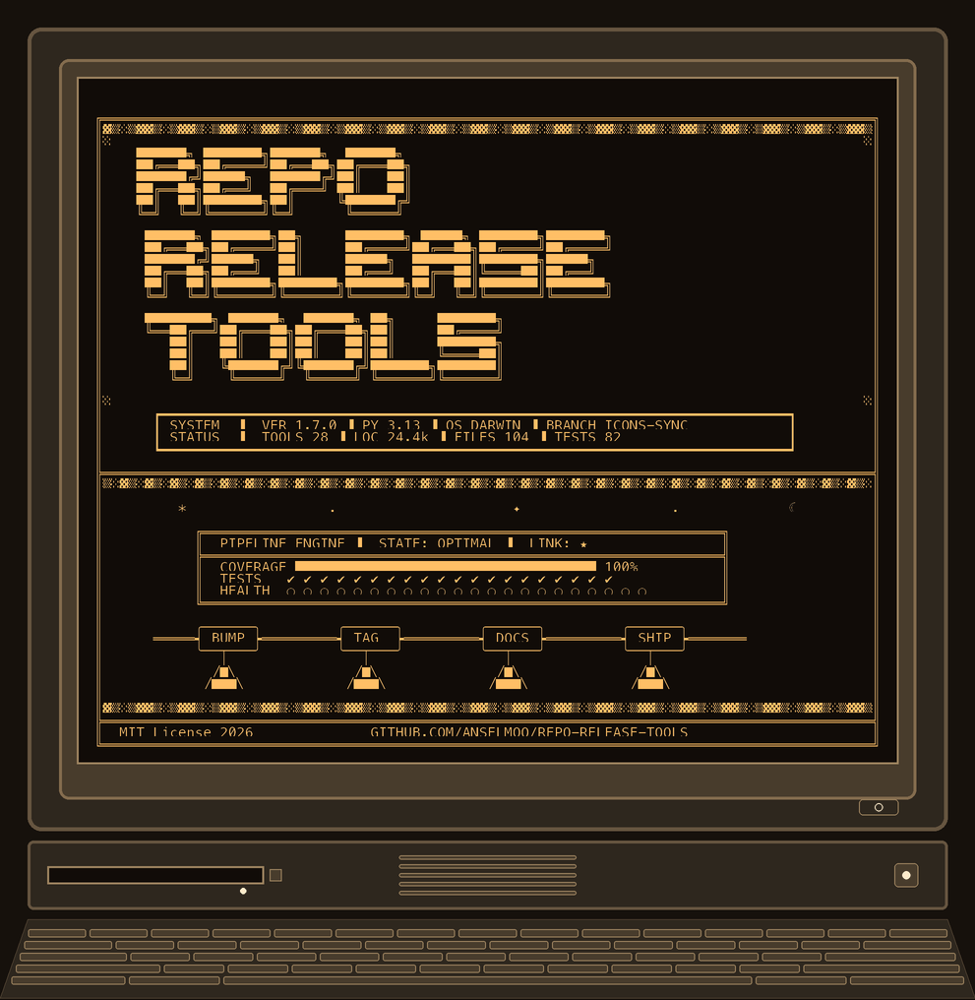
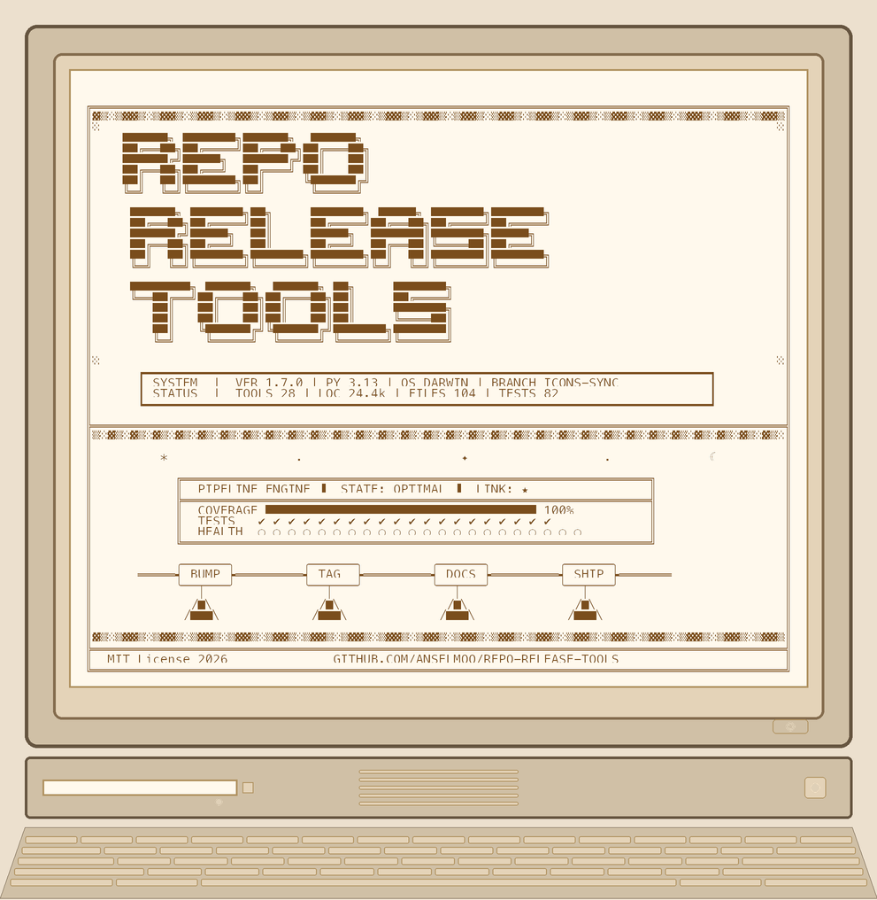
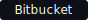
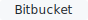
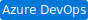
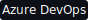
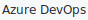
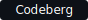
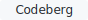

<!-- rrt:auto:start:page-header -->

<a href="https://github.com/Anselmoo/repo-release-tools"><picture>
  <source media="(prefers-color-scheme: dark)" srcset="assets/badges/github-reto-dark.svg">
  <source media="(prefers-color-scheme: light)" srcset="assets/badges/github-reto-light.svg">
  
</picture></a>

<!-- rrt:auto:end:page-header -->

# repo-release-tools

`repo-release-tools` has three main surfaces:

- **[Generated CLI reference](commands/rrt-cli.md)** for local release automation, Git
  helpers, config inspection, and the bundled `rrt skill install` command
- **[GitHub Action](action.md)** for CI policy checks that mirror the
  local workflow
- **Generated topic docs**:
  [Semantic branches](commands/branch.md) and [rrt git](commands/git_cmd.md) for
  the branch naming model and Git workflow guidance

If you need command syntax, start with the generated CLI reference first. It is
the canonical home for the current `rrt` command surface.

## Start here

- [Generated CLI reference](commands/rrt-cli.md) — generated reference for branches, bumps, Git
  workflow helpers, config checks, and skill installation
- [GitHub Action](action.md) — CI checks for branch names, commit
  subjects, changelog policy, and optional doctor/dirty-tree gates
- [pre-commit / lefthook](commands/hooks.md) — local hook setup for incremental or
  squash-based changelog workflows
- [Skills](commands/skill.md) — bundled `uvx` and installed-CLI agent skills

## Then follow the workflow

<!-- rrt:auto:start:index-topic-links -->
- [rrt branch](commands/branch.md) — generated branch naming model and allowed branch types
- [rrt git](commands/git_cmd.md) — generated Git helpers and workflow shortcuts
- [rrt tree](commands/tree.md) — generated guide for `rrt tree` output modes, ignore behavior, and traversal controls
- [MCP Server](mcp-server.md) — MCP install and connect guide
<!-- rrt:auto:end:index-topic-links -->

## Command reference by group

The CLI is split into per-group reference pages (auto-generated from the live argparse tree) and
prose topic pages for individual commands.

### Auto-generated group reference pages

| Group | Commands | Page |
|---|---|---|
| **Version & Release** | `bump`, `changelog`, `ci-version`, `release`, `workspace`, `tag` | [version-release](commands/version-release.md) |
| **Repository Health** | `doctor`, `artifacts`, `config`, `env`, `eol`, `toc`, `tree`, `docs`, `drift`, `folder` | [repo-health](commands/repo-health.md) |
| **Git Workflow** | `branch`, `git` | [git-workflow](commands/git-workflow.md) |
| **CI & Automation** | `action` | [ci-automation](commands/ci-automation.md) |
| **Setup & Tooling** | `install`, `init`, `skill`, `agents`, `hooks` | [setup-tooling](commands/setup-tooling.md) |

The [rrt CLI index](commands/rrt-cli.md) page has the global help and links to all groups.

### Prose topic pages

| Doc | Content |
|---|---|
| [branch](commands/branch.md) | Branch naming model and allowed types |
| [bump](commands/bump.md) | Stub — see [version-release](commands/version-release.md) |
| [ci_version](commands/ci_version.md) | Stub — see [version-release](commands/version-release.md) |
| [config_cmd](commands/config_cmd.md) | Stub — see [repo-health](commands/repo-health.md) |
| [doctor](commands/doctor.md) | Repository automation health checks |
| [drift](commands/drift.md) | Agent-facing surface drift detection |
| [env_cmd](commands/env_cmd.md) | Stub — see [repo-health](commands/repo-health.md) |
| [eol_check](commands/eol_check.md) | Runtime end-of-life checks |
| [folder](commands/folder.md) | Folder structure supervision |
| [git_cmd](commands/git_cmd.md) | Git workflow helpers |
| [hooks](commands/hooks.md) | pre-commit / lefthook hook setup |
| [init](commands/init.md) | Stub — see [setup-tooling](commands/setup-tooling.md) |
| [install](commands/install.md) | Agent surface installation |
| [skill](commands/skill.md) | Bundled agent skills |
| [toc](commands/toc.md) | Markdown TOC generation |
| [tree](commands/tree.md) | Directory tree rendering |

## Changelog workflow

`repo-release-tools` supports two changelog styles:

- `incremental` *(default)* — maintain changelog state during development
- `squash` — skip per-commit changelog enforcement and generate or correct
  changelog entries when changes are squashed together

If you are unsure where to start:

1. Read [`commands/rrt-cli.md`](commands/rrt-cli.md) to confirm the available CLI commands and
   `changelog_workflow` config
2. Read [`commands/hooks.md`](commands/hooks.md) for the matching local hook setup
3. Read [`action.md`](action.md) to see how
   `changelog-strategy: auto` follows that workflow in CI

## Visual identity

### Terminal banners

| Dark theme | Light theme |
|---|---|
|  |  |

*Rendered by `rrt` at launch. ASCII art generated by `banner.py` using Pillow.*

### Badge families

Adaptive SVG badges switch automatically between dark and light variants based
on the viewer's system preference (`prefers-color-scheme`). Five variants per
badge family are available:

These badges are intentionally complete for the current source-of-truth icon
registry in [`src/repo_release_tools/tools/platform.py`](../src/repo_release_tools/tools/platform.py).
If an icon appears missing, update the registry and badge mappings together so
the docs, source-code anchors, and icon list stay in lockstep across platform,
registry, and language labels.

#### Platform

| Label | Color | Dark | Light | Reto Dark | Reto Light |
|---|---|---|---|---|---|
| GitHub |  |  |  |  |  |
| GitLab |  |  |  |  |  |
| Bitbucket |  |  |  |  |  |
| Azure DevOps |  |  |  |  |  |
| Codeberg |  |  |  |  |  |
| Gitea |  |  |  |  |  |
| Helm |  |  |  |  |  |
| Kubernetes |  |  |  |  |  |
| GitHub Actions |  |  |  |  |  |
| Bash |  |  |  |  |  |
| Java |  |  |  |  |  |
| Generic |  |  |  |  |  |

#### Registry

| Label | Color | Dark | Light | Reto Dark | Reto Light |
|---|---|---|---|---|---|
| PyPI |  |  |  |  |  |
| npm |  |  |  |  |  |
| NuGet |  |  |  |  |  |
| Cargo |  |  |  |  |  |
| RubyGems |  |  |  |  |  |
| Packagist |  |  |  |  |  |
| Docker |  |  |  |  |  |

#### Language

| Label | Color | Dark | Light | Reto Dark | Reto Light |
|---|---|---|---|---|---|
| Python |  |  |  |  |  |
| JavaScript |  |  |  |  |  |
| TypeScript |  |  |  |  |  |
| Go |  |  |  |  |  |
| Rust |  |  |  |  |  |
| .NET |  |  |  |  |  |
| Ruby |  |  |  |  |  |
| PHP |  |  |  |  |  |
| C++ |  |  |  |  |  |
| Swift |  |  |  |  |  |
| Kotlin |  |  |  |  |  |
| Dart |  |  |  |  |  |
| Perl |  |  |  |  |  |
| Scala |  |  |  |  |  |
| Haskell |  |  |  |  |  |

Badge icons sourced from [Simple Icons](https://simpleicons.org) (CC0-1.0) and
[Google Material Icons](https://fonts.google.com/icons) (Apache-2.0). See
`src/repo_release_tools/tools/platform.py` for full attribution.
`Bash` and `Java` appear in both the Platform and Language label sets; they are
listed under Platform only.

<!-- rrt:auto:start:doc-footer -->
---

[↑ Docs index](https://github.com/Anselmoo/repo-release-tools/blob/main/docs/index.md) · [CLI reference](https://github.com/Anselmoo/repo-release-tools/blob/main/docs/commands/rrt-cli.md) · [Changelog](https://github.com/Anselmoo/repo-release-tools/blob/main/CHANGELOG.md) · [GitHub](https://github.com/Anselmoo/repo-release-tools)
<!-- rrt:auto:end:doc-footer -->
